# NeighborLink Setup Guide

**Estimated Setup Time:** Approximately 1 to 6 hours

NeighborLink is a router solution designed for securely sharing Starlink internet with neighbors and family members. Please note that you can use any other internet source instead of Starlink. Our source here is on Starlink because it is not censored in Iran.

Although we have successfully tested this method on the Iranian internet, if you live in another country where the internet is censored, you can use this same method to access free internet and share it with others.

With NeighborLink, you can:
* Hide the IP of your Starlink connection.
* Use both Iranian internet and Starlink internet simultaneously (domestic websites via Iranian internet, blocked websites via Starlink).
* Share Starlink internet with neighbors.

And by adding CityLink, you can:
* Connect to Starlink remotely through Iranian internet with no geographical restriction.
* Establish a route to connect to an Outline server.

## Steps to Set Up NeighborLink

### 1. Equipment Required
* A supported router from the list provided in the [Latest Release](https://github.com/nasnet-community/neighbor-link/releases/latest).
* **Internet from Starlink** with WiFi connectivity.
* **Iranian Internet** with the ability to connect via Ethernet.
* **Network cable** to connect the Iranian internet modem to NeighborLink.
* **Computer or Laptop** for setup

### 2. Initial Setup
1. Connect the TP-Link modem to power and wait for it to become accessible.
2. Access the modem panel and navigate to **System Tools** -> **Firmware**.

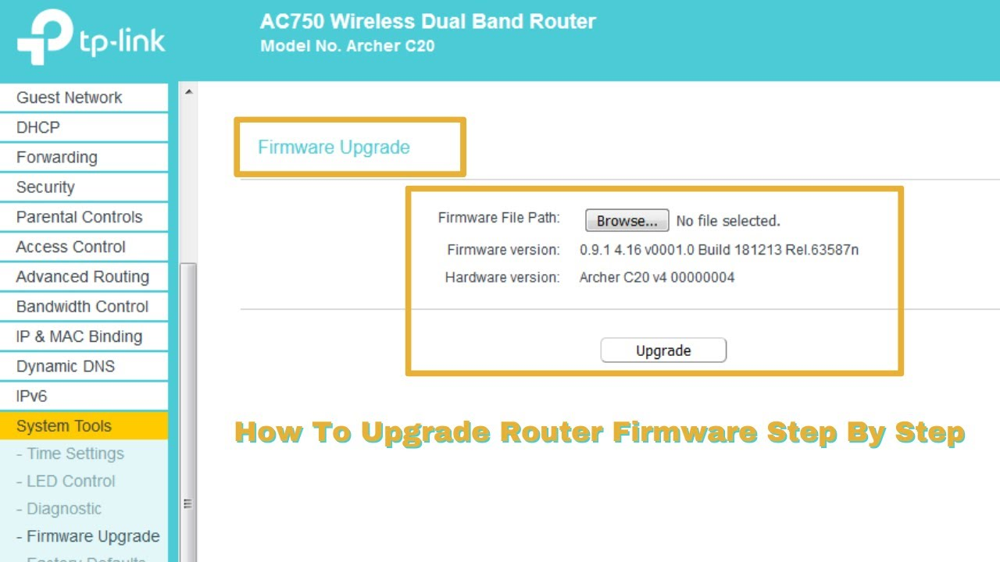

3. Download the NeighborLink binary file from our Github [link here](https://github.com/nasnet-community/neighbor-link/releases/latest) and upload it to the modem.
    * Select **Browse** from the menu, open the downloaded file, and click **Upgrade**. The upgrade process will take approximately 10 minutes. Do not disconnect the power cable during this time.
4. After the upgrade, the router will become NeighborLink. Follow the setup steps below.

### 3. Important Notes for Setup
* **Internet from Starlink** with WiFi capability.
* **Iranian Internet** with Ethernet connectivity to the router.
* **Network Cable** for connecting the Iranian internet modem to NeighborLink.
* **Connection to Computer/Laptop** via cable is recommended, but WiFi is also an option (slightly more complex steps).

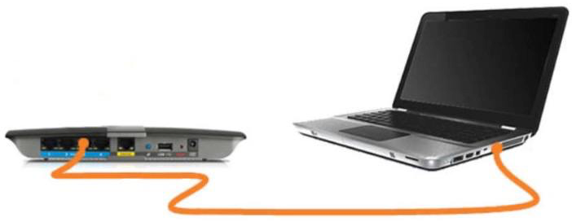

### 4. Configuration Steps

1. Connect your computer or phone to NeighborLink (recommended via computer and cable).
    * If connecting via WiFi, join the network **TP-Link-2G** or **TP-Link-5G** using the password **goodlife**. For a cable connection, plug the network cable into one of the yellow sockets on NeighborLink and connect it to your laptop.

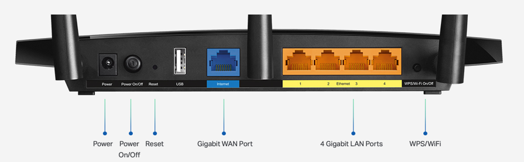

### 5. Accessing the Router

1. Open your web browser and navigate to `http://192.168.151.1`. Ignore any security warnings.
2. Enter the initial password: `goodlife`.

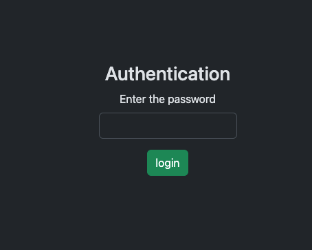

### 6. Connecting NeighborLink to Starlink (Dashboard Page: Step 1)

1. Click Scan to find available WiFi networks.
2. Select the WiFi network for Starlink and enter the password.
3. Once status turned to connected, click Next.

> **Important Note:** If there are many WiFi networks around you, you may need to press the scan button and watch the results multiple times to see the WiFi name for Starlink appear in the list.

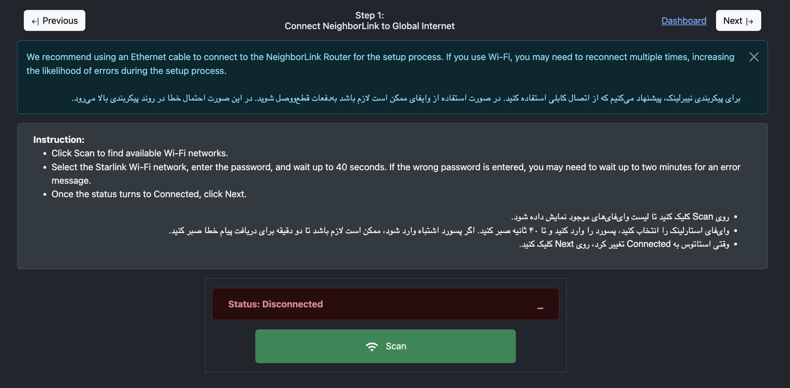

### 7. Connecting to Iranian Internet (Dashboard Page: Step 2)

1. Connect a network cable from the Iranian internet modem (one of the yellow or black ports) to the blue WAN port on NeighborLink.

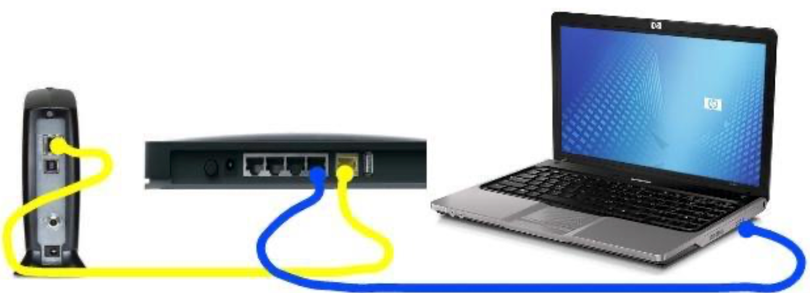

2. Wait approximately 10 seconds, then click **Check Connection**.

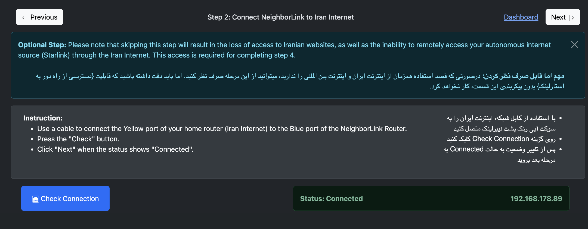

3. Once connected (status: Connected), proceed to the next step.

### 8. Hiding the Starlink IP (Dashboard Page: Step 3)

1. Obtain a Wireguard config.
2. Copy the Wireguard config into the box below.
3. Press the Set Wireguard Config button. You may need to wait up to one minute.
4. Turn the VPN On. You might need to wait up to three minutes for the IP to change. Even after toggling to On, you may still need to wait for the IP update.
5. Check your internet connection. If disconnected, toggle the VPN Off and On again, then wait for 20 seconds.
6. Once everything is working properly, click Next.

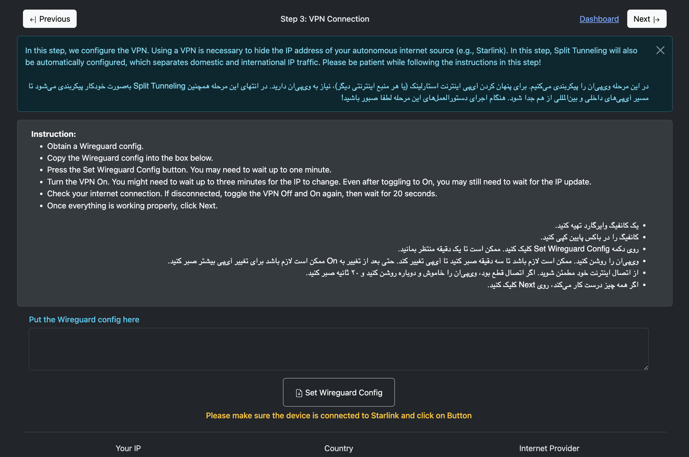
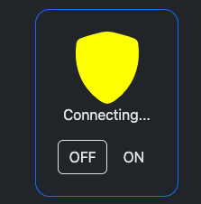

### 9. Sharing Internet with Neighbors (Dashboard Page: Step 4)

1. Enable the guest WiFi networks **Guest-2G** and **Guest-5G**. You can change these network names.
2. Set a password for your guest network. Although it is common to leave the password field blank, it is recommended to set a simple password. This helps prevent unauthorized access by passersby who might connect to the system and cause disruptions.
3. Go to User Management and create unique usernames and passwords for each neighbor (user).

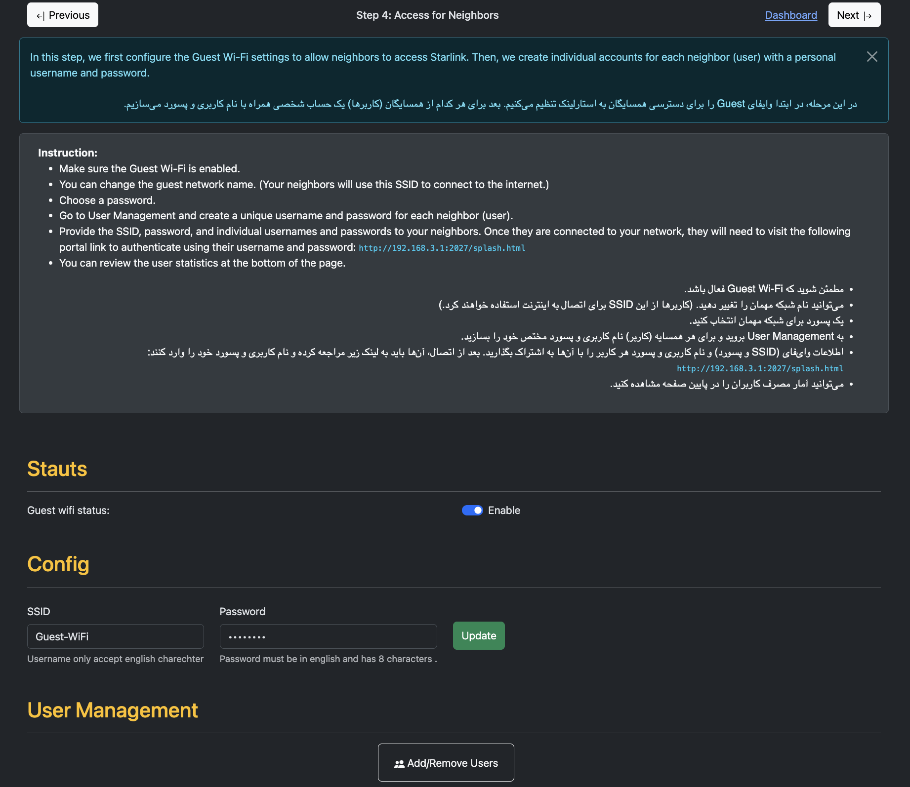

### 10. CityLink Remote Access Configuration (Dashboard Page: Step 5)

CityLink has additional requirements, these are:
- A VPS (Virtual Private Server) based in Iran (Minimum Ubuntu 22.04)
- A domain name configured to point to the IP address of your VPS in Iran
- An existing Outline key for Outline support

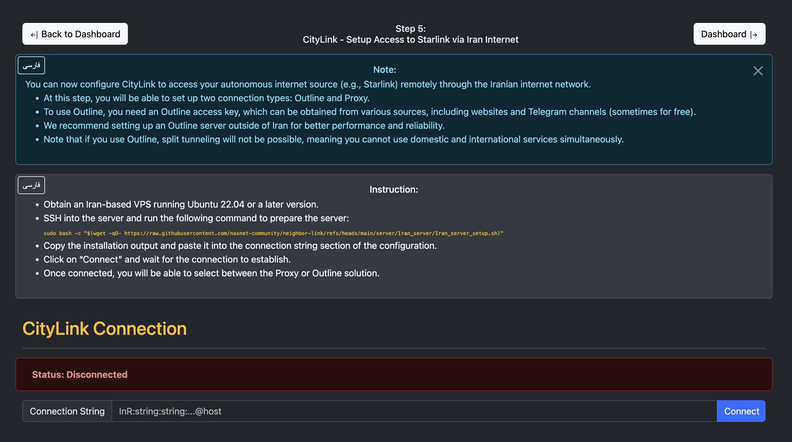

1. Connect to your Iran VPS using SSH
2. Run the command provided in the Step 5 Instructions
3. Copy the output of the command from the SSH terminal and paste it in the box called Connection String and click Connect

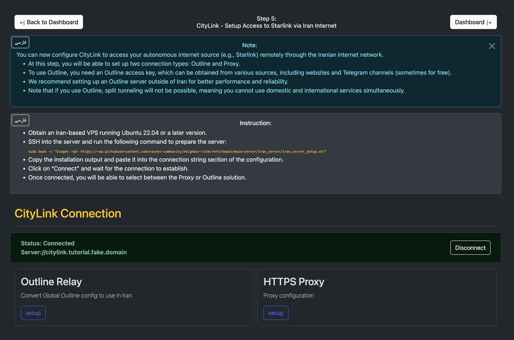

Once the Status is **Connected** you can now setup the Outline Relay or HTTPS Proxy

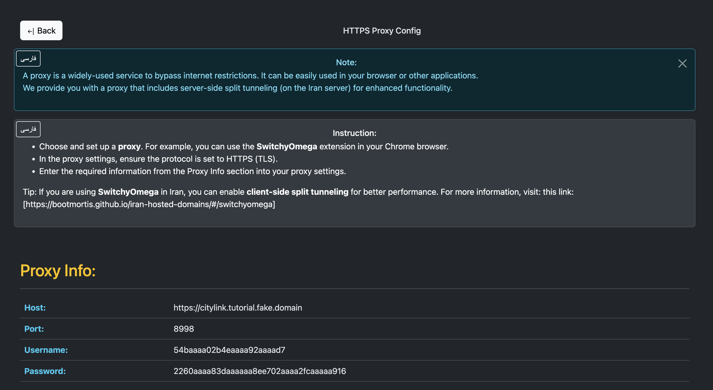

To set up the HTTPS Proxy, click the setup button and follow the on screen instructions.

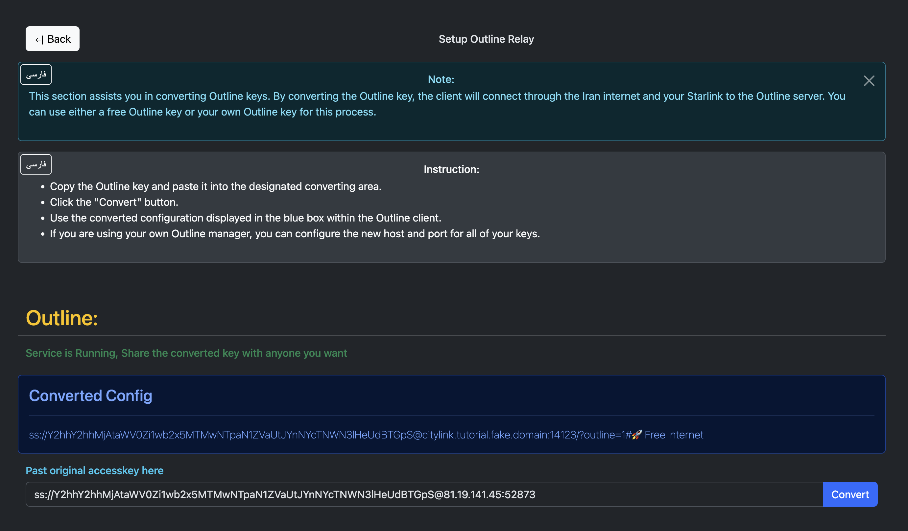

To set up the Outline Relay, obtain an existing Outline Key and place it in the Outline Relay setup page and click Convert. This will reveal a Converted Config which you can share.
