# Bypassing Iranian Internet Censorship 

## A Comprehensive Guide to Using **Starlink**, **Mikrotik Router**, and **OpenVPN** for Secure Remote Access

## Introduction

This document provides a step-by-step guide for installing and configuring the OpenVPN service on a Mikrotik router. The main goal is to create a **secure** tunnel to Starlink, allowing **multiple users** to access **uncensored** Starlink internet through OpenVPN from with** no geographical restrictions** while connected to the internal Iranian network. While this method can be applied to other routers, we strongly recommend using the specified devices.

### Glossary

* **Host**: The person who owns, installs and configures the Starlink connection.
* **User**: The person who remotely connects to Starlink using OpenVPN.
* **Host Modem**: The modem that manages traffic between the internal Iranian network and the Mikrotik router.

### Objectives and Setup Steps

1. **Connecting Users to the Host Modem via Internal Internet**: Users can connect to the host modem through the internal internet using an OpenVPN client. This ensures all traffic between the user and the host is encrypted. The steps for this phase are marked in the manual.
2. **Forwarding User Requests to the Mikrotik Router**: Requests from users are transmitted from the host modem to the Mikrotik router.
3. **Split Tunneling on the Mikrotik Router**:
    * **Internal Requests**: These are routed back to the host modem and sent through the internal internet network.
    * **International Requests**: These are directed to Starlink and the global internet network.
4. **Hiding Starlink IP**: The Starlink IP is concealed using a VPS, which is positioned after the Starlink connection. Mikrotik routers are not compatible with VPNs like NordVPN or ExpressVPN.

### Benefits of Following All Steps

* **Access to Internal Services**: Users can access internal services and satellite internet without being identified or having to turn on/off his VPN.
* **Hiding Starlink IP**: The Starlink IP is hidden from users.
* **Simultaneous Use by Multiple Users**: This method allows multiple users to use the Starlink internet at the same time.
* **No Geographical Restrictions**: Users can connect to Starlink from any location.

### Can I Skip Some Steps?

It's recommended to follow all steps carefully. However, if security is less of a concern for you, you can skip the following steps:

* **Skip Split Tunneling**: If you don't want to separate Iranian and international traffic, you can skip the split tunneling steps. But if you do, users will need to turn off their VPN whenever they want to access internal services like banking, since the Starlink IP is non-Iranian.
* **Skip Hiding Starlink IP**: If you don't want to hide the Starlink IP, you can skip these steps. Proper split tunneling makes hiding the IP less critical, but there is a high risk that internal services might detect Starlink usage. Also, users will know they're connected to a Starlink device.
* **Skip Static IP**: You can skip obtaining a static IP, though it means you'll need to update your Mikrotik router configuration more frequently. Without a static IP, if the host modem is off for several hours or the ISP changes the IP, you'll have to update configurations. This usually happens every few months, so having a static IP is not essential.
* **Starlink Device Generation**: This manual is designed for Starlink generations 1 and 2, which usually don't have an adapter in Iran. Users with an adapter or using generation 3 and beyond can connect their Starlink directly to the Mikrotik router via cable, avoiding the WiFi setup steps in this manual. However, completing these steps will allow for wireless connection of the Starlink router to the Mikrotik router.

### **Disadvantages of This Method**

* **Complex Setup**: This method requires precision and skill for setup. It's recommended to use the suggested methods and devices.
* **Need for a Static IP**: The host needs to use a static IP. However, if you can inform users of the new IP whenever it changes, a static IP is not strictly necessary.
* **Increased Internet Usage for Host**: This method will increase the host's internet usage. (Costs can be shared among users, making this method more cost-effective and faster than a normal VPN.)

### **Recommendations**

Depending on your familiarity with networking, OpenVPN, and Mikrotik routers, allocate between 2 hours to 3 days for installing and setting up this system. We recommend using the suggested software, tools, and devices to achieve your desired results more quickly and reliably. If you use other methods or tools, please share your experiences on our forums to help others benefit from different approaches. Our goal is to enhance the knowledge and literature around this topic.

### **Required Tools and Equipment**

* Mikrotik router hap ax2
* Modem and static IP
* Starlink modem and receiver
* VPS with Mikrotik OS v7.x to hide the Starlink IP (optional)
* 2 LAN cables
* Windows PC/laptop
* [Mikrotik Winbox](https://mikrotik.com/download)
* A note-taking tool

### **Topology**

## Setup

1. Install the Winbox application. We do not recommend using web applications since they might have different default configurations.
2. Connect one of the yellow ports on your ADSL modem to the Lan2 port on the Mikrotik router. Please do not change this port or plug the cable into another port during the setup.
3. Connect the Lan3 port on the Mikrotik router to your computer. Again, do not change this port or plug the cable into another port during the setup.

### **Connect**

* Connect to: 192.168.88.1
* Login: (found on your Mikrotik router)
* Password: (found on your Mikrotik router)
* Click on Connect.
* On your first login, you may be prompted to change your password. Choose a password that is easy to type, as you will need to enter it multiple times in Winbox during the setup.
* Go to the Setting Menu and deselect Hide Password (to make things easier).

### **Remove Slave from Interface**

In some routers, `wifi2` or `ether2` are set as slaves by default. This setting needs to be disabled.

* Go to **Bridge** (left menu) -> **Ports**
* For `ether2`: Right-click and select **Remove**
* For `wifi2`: Right-click and select **Remove**

**Note**: In some cases, `wifi2` and `ether2` might not be listed under Ports. If this is the case, you can proceed to the next step.

#### Backup

We recommend creating a backup of your settings after each step. To do this:

* Go to **Files** -> **Backup**

## Wireless and Ethernet Interfaces

In this section, we will create two interfaces: a WiFi interface as a WiFi Station to connect to the Starlink modem and an Ethernet interface to connect to the host modem with a static IP.

### WiFi Station Setup in MikroTik Wireless Router

By enabling Wireless Station Mode, we can set up the WiFi Client. To enable Wireless Station Mode, follow these two steps:

#### DHCP Client Configuration on Wireless Interface

* Go to **IP** -> **DHCP Client** -> click **+** (new)
    * Interface: `wifi2`
    * Use Peer DNS: ✅
    * Use Peer NTP: ✅
    * Add Default Route: No

>>>>>  gd2md-html alert: inline image link here (to images/image2.png). Store image on your image server and adjust path/filename/extension if necessary.  (<a href="#">Back to top</a>)(<a href="#gdcalert3">Next alert</a>) >>>>> 

#### Wireless Station Configuration on Wireless Interface

Configure the Wireless Station to connect to the Starlink WiFi SSID:

* Go to **Interfaces** -> Right-click on `wifi2` and enable -> double-click `wifi2` to open -> **General Tab**
    * Mode: `Station`

>>>>>  gd2md-html alert: inline image link here (to images/image3.png). Store image on your image server and adjust path/filename/extension if necessary.  (<a href="#">Back to top</a>)(<a href="#gdcalert4">Next alert</a>) >>>>> 

* Go to **Security Tab**
    * Authentication Type: `WPA PSK`, `WPA2 PSK`
    * Passphrase: Your Starlink Password
    * Click **Apply**

>>>>>  gd2md-html alert: inline image link here (to images/image4.png). Store image on your image server and adjust path/filename/extension if necessary.  (<a href="#">Back to top</a>)(<a href="#gdcalert5">Next alert</a>) >>>>> 

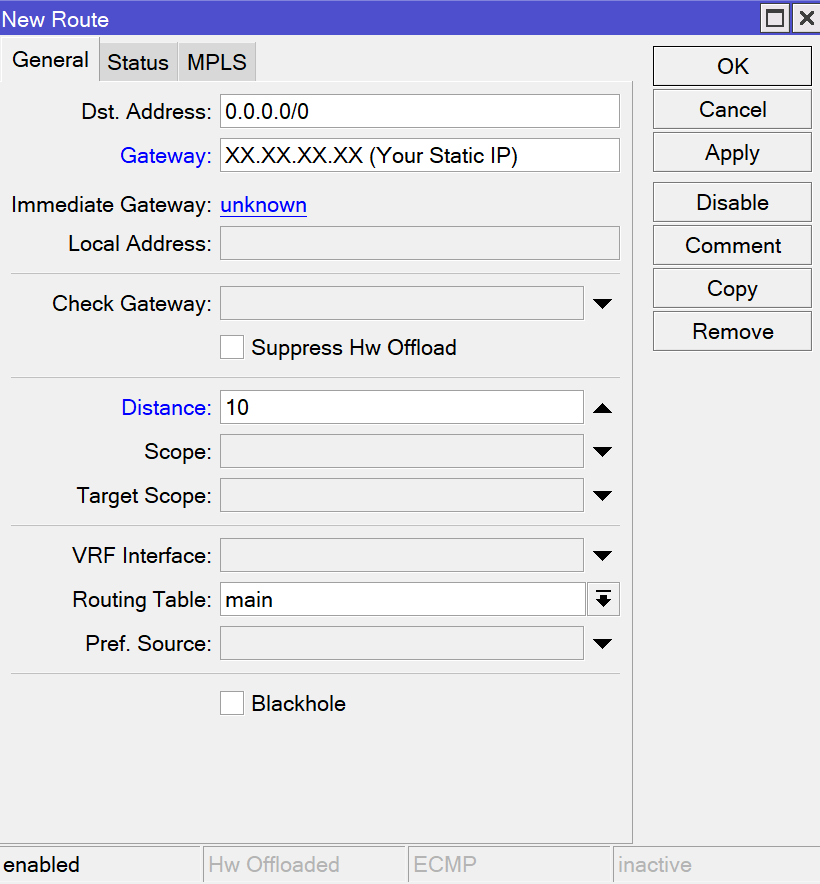

* Click **Scan**
    * Interface: `wifi2`
    * Click **Start**
    * Select your SSID (Starlink)
    * Click **Connect**

>>>>>  gd2md-html alert: inline image link here (to images/image5.png). Store image on your image server and adjust path/filename/extension if necessary.  (<a href="#">Back to top</a>)(<a href="#gdcalert6">Next alert</a>) >>>>> 

#### Milestone

If you have followed the steps correctly, the status of `wifi2` should show as `RMB` or `RSMB`. The letter `R` in the status column indicates that the interface is running.

>>>>>  gd2md-html alert: inline image link here (to images/image6.png). Store image on your image server and adjust path/filename/extension if necessary.  (<a href="#">Back to top</a>)(<a href="#gdcalert7">Next alert</a>) >>>>> 

### **Ethernet Interface Setup**

#### Connect the Ethernet port to your host modem

* Go to **Interface** -> **Interface Tab** -> right-click on `ether2` and select **Enable**.

>>>>>  gd2md-html alert: inline image link here (to images/image7.png). Store image on your image server and adjust path/filename/extension if necessary.  (<a href="#">Back to top</a>)(<a href="#gdcalert8">Next alert</a>) >>>>> 

#### DHCP Client for Ethernet Interface

* Go to **IP** -> **DHCP Client** -> click **+** (new).
* In the **DHCP Tab**:
    * Interface: `ether2`
    * Use Peer DNS: ✅
    * Use Peer NTP: ✅
    * Add Default Route: No

>>>>>  gd2md-html alert: inline image link here (to images/image8.png). Store image on your image server and adjust path/filename/extension if necessary.  (<a href="#">Back to top</a>)(<a href="#gdcalert9">Next alert</a>) >>>>> 

### NAT Setup

Here we will define rules for two NATs, one for `wifi2` and one for `ethernet2`. The source NAT will be the VPN-Pool Addresses.

#### NAT for Ethernet Interface

* Go to **IP** -> **Firewall** -> **NAT Tab** -> click **+** (new).
* In the **General Tab**:
    * Chain: `srcnat`
    * Src. Address: `10.100.0.0/24`
    * Out. Interface: `ether2`

>>>>>  gd2md-html alert: inline image link here (to images/image9.png). Store image on your image server and adjust path/filename/extension if necessary.  (<a href="#">Back to top</a>)(<a href="#gdcalert10">Next alert</a>) >>>>> 

* Go to the **Action Tab**:
    * Action: `Masquerade`
    * Click **OK**.

>>>>>  gd2md-html alert: inline image link here (to images/image10.png). Store image on your image server and adjust path/filename/extension if necessary.  (<a href="#">Back to top</a>)(<a href="#gdcalert11">Next alert</a>) >>>>> 

 \

#### NAT for WiFi Interface

* Go to **IP** -> **Firewall** -> **NAT Tab** -> click **+** (new).
* In the **General Tab**:
    * Chain: `srcnat`
    * Src. Address: `10.100.0.0/24`
    * Out. Interface: `wifi2`
* Go to the **Action Tab**:
    * Action: `Masquerade`
    * Click **OK**.

## OpenVPN Server on MikroTik

Now we need to set up the OpenVPN Server on MikroTik.

### VPN Pool Setup

#### Create an IP pool for VPN clients:

* Go to **IP** -> **Pool** -> **Pools Tab** -> click **+** (new).
    * Name: `vpn-pool`
    * Addresses: `10.100.0.2-10.100.0.254`
    * Next Pool: `none`
    * Click **OK**.

>>>>>  gd2md-html alert: inline image link here (to images/image11.png). Store image on your image server and adjust path/filename/extension if necessary.  (<a href="#">Back to top</a>)(<a href="#gdcalert12">Next alert</a>) >>>>> 

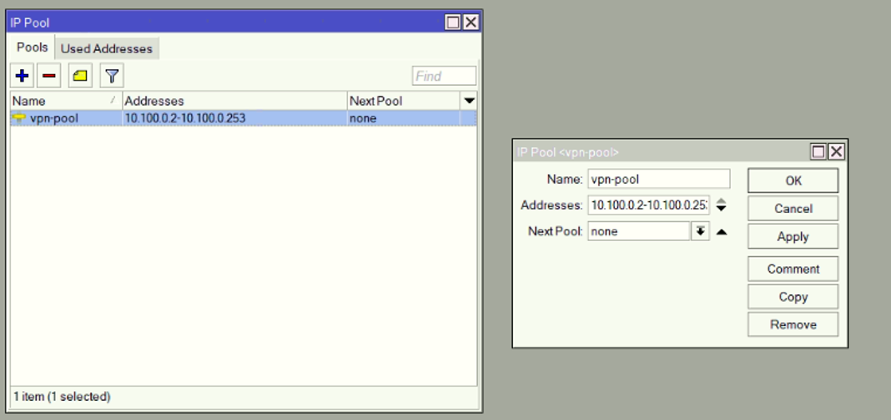

#### Create Certificates

##### Create CA Certificate

* Go to **System** -> **Certificates** -> **Certificates Tab** -> click **+** (new).
* In the **General Tab**:
    * Name: `CA`
    * Common Name: `CA`
    * Key Size: `2048`
    * Days Valid: `3650` (or your preferred duration)

>>>>>  gd2md-html alert: inline image link here (to images/image12.png). Store image on your image server and adjust path/filename/extension if necessary.  (<a href="#">Back to top</a>)(<a href="#gdcalert13">Next alert</a>) >>>>> 

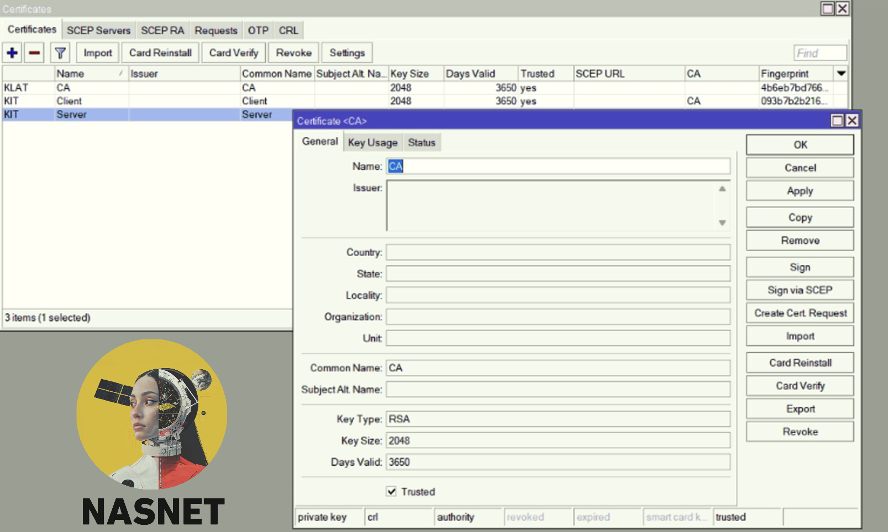

* In the **Key Usage Tab**:
    * Enable `key cert. sign` and `crl sign`.
    * Uncheck other options.
    * Click **OK**.

>>>>>  gd2md-html alert: inline image link here (to images/image13.png). Store image on your image server and adjust path/filename/extension if necessary.  (<a href="#">Back to top</a>)(<a href="#gdcalert14">Next alert</a>) >>>>> 

##### Create Server Certificate

* Go to **System** -> **Certificates** -> **Certificates Tab** -> click **+** (new).
* In the **General Tab**:
    * Name: `Server`
    * Common Name: `Server`
    * Key Size: `2048`
    * Days Valid: `3650`

>>>>>  gd2md-html alert: inline image link here (to images/image14.png). Store image on your image server and adjust path/filename/extension if necessary.  (<a href="#">Back to top</a>)(<a href="#gdcalert15">Next alert</a>) >>>>> 

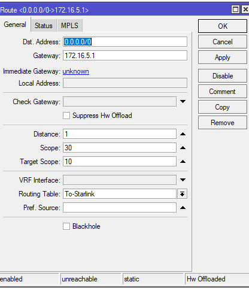

* In the **Key Usage Tab**:
    * Enable `digital signature`, `key encipherment`, and `tls server`.
    * Uncheck other options.
    * Click **OK**.

>>>>>  gd2md-html alert: inline image link here (to images/image15.png). Store image on your image server and adjust path/filename/extension if necessary.  (<a href="#">Back to top</a>)(<a href="#gdcalert16">Next alert</a>) >>>>> 

##### Create Client Certificate

* Go to **System** -> **Certificates** -> **Certificates Tab** -> click **+** (new).
* In the **General Tab**:
    * Name: `Client`
    * Common Name: `Client`
    * Key Size: `2048`
    * Days Valid: `3650`

>>>>>  gd2md-html alert: inline image link here (to images/image16.png). Store image on your image server and adjust path/filename/extension if necessary.  (<a href="#">Back to top</a>)(<a href="#gdcalert17">Next alert</a>) >>>>> 

* In the **Key Usage Tab**:
    * Enable `tls client`.
    * Uncheck other options.
    * Click **OK**.

>>>>>  gd2md-html alert: inline image link here (to images/image17.png). Store image on your image server and adjust path/filename/extension if necessary.  (<a href="#">Back to top</a>)(<a href="#gdcalert18">Next alert</a>) >>>>> 

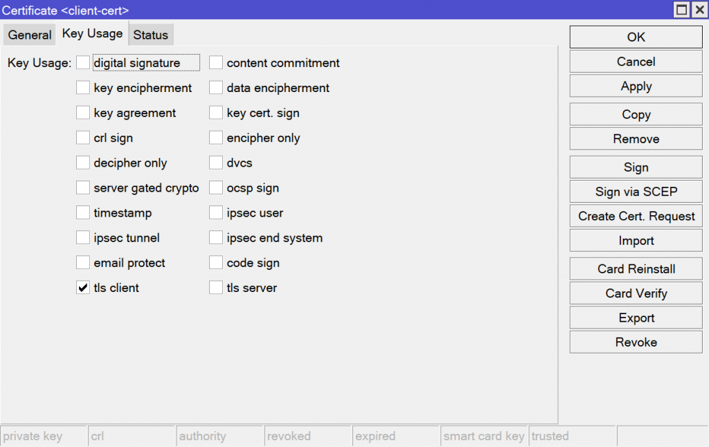

#### Signing the Certificates

##### Signing the CA Certificate

* Go to **System** -> **Certificates** -> **Certificates Tab**.
    * Select `CA`
* Click **Sign**.
    * Certificate: `CA`
    * Click **Start** (this may take some time).

>>>>>  gd2md-html alert: inline image link here (to images/image18.png). Store image on your image server and adjust path/filename/extension if necessary.  (<a href="#">Back to top</a>)(<a href="#gdcalert19">Next alert</a>) >>>>> 

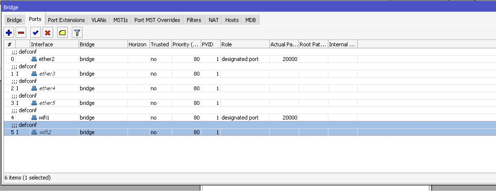

##### Signing the Server Certificate

* Go to **System** -> **Certificates** -> **Certificates Tab**.
    * Select `Server`
* Click **Sign**.
    * Certificate: `Server`
    * CA: `CA`
    * Click **Start**.

>>>>>  gd2md-html alert: inline image link here (to images/image19.png). Store image on your image server and adjust path/filename/extension if necessary.  (<a href="#">Back to top</a>)(<a href="#gdcalert20">Next alert</a>) >>>>> 

##### Signing the Client Certificate

* Go to **System** -> **Certificates** -> **Certificates Tab**.
    * Select `Client`
* Click **Sign**.
    * Certificate: `Client`
    * CA: `CA`
    * Click **Start**.

>>>>>  gd2md-html alert: inline image link here (to images/image20.png). Store image on your image server and adjust path/filename/extension if necessary.  (<a href="#">Back to top</a>)(<a href="#gdcalert21">Next alert</a>) >>>>> 

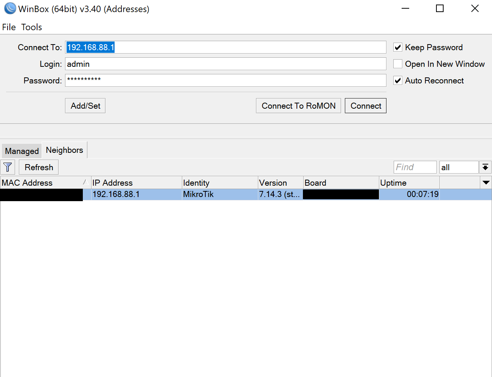

##### Trusting the Certificates

* Go to **System** -> **Certificates** -> **Certificates Tab**.
* Select `CA`, `Server`, and `Client` (one by one).
    * Check the **Trusted** box for each.

>>>>>  gd2md-html alert: inline image link here (to images/image21.png). Store image on your image server and adjust path/filename/extension if necessary.  (<a href="#">Back to top</a>)(<a href="#gdcalert22">Next alert</a>) >>>>> 

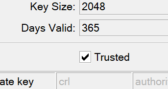

### **OpenVPN Server Interface Setup**

* Go to **PPP** -> **Interface Tab** -> **OVPN Server**.
    * Enabled: ✅
    * Port: `1194` (or another free port)
    * Mode: `ip` (This is for layer 3 VPN. For layer 2 VPN, select `ethernet`.)
    * Protocol: `tcp` (UDP is not recommended)
    * Netmask: `24` (CIDR netmask for your LAN subnet)
    * Default Profile: `Openvpn`
    * Certificate: `Server`
    * Uncheck "Require Client Certificate": ❌
    * Authentication: Check `sha1` ✅ and uncheck others ❌
    * Cipher: Check `aes 128 cbc`, `aes 192 cbc`, and `aes 256 cbc` ✅ and uncheck others ❌
    * Click **OK**.

This will configure and enable the OpenVPN server interface on your MikroTik router.

#### Create PPP Profile

* Go to **PPP** -> **Profiles Tab** -> click **+** (new).
* In the **General Tab**:
    * Name: `Openvpn` (or any preferred name)
    * Local Address: `10.100.0.1`
    * Remote Address: `vpn-pool`
    * DNS: `8.8.8.8` (or any other DNS server)
    * Click **OK**.

>>>>>  gd2md-html alert: inline image link here (to images/image22.png). Store image on your image server and adjust path/filename/extension if necessary.  (<a href="#">Back to top</a>)(<a href="#gdcalert23">Next alert</a>) >>>>> 

#### Create VPN User

* Go to **PPP** -> **Secrets Tab** -> click **+** (new)
    * Name: `JooJoo` (or any preferred name)
    * Password: Enter a password.
    * Service: `ovpn`
    * Profile: `Openvpn`
    * Click **OK**.

>>>>>  gd2md-html alert: inline image link here (to images/image23.png). Store image on your image server and adjust path/filename/extension if necessary.  (<a href="#">Back to top</a>)(<a href="#gdcalert24">Next alert</a>) >>>>> 

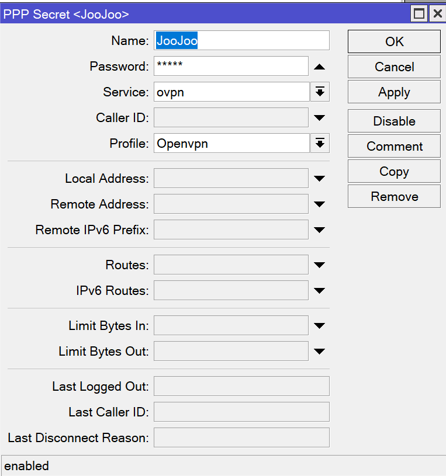

### Exporting the Certificates

#### Exporting the CA Certificate

* Go to **System** -> **Certificates** -> **Certificates Tab**.
    * Select `CA`.
* Click **Export** (leave the passphrase blank).
    * Click **Export** on the new window.
    * File Name: CA (recommended)

>>>>>  gd2md-html alert: inline image link here (to images/image24.png). Store image on your image server and adjust path/filename/extension if necessary.  (<a href="#">Back to top</a>)(<a href="#gdcalert25">Next alert</a>) >>>>> 

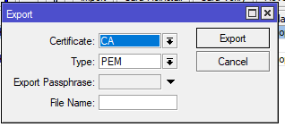

#### Exporting the Client Certificate

* Go to **System** -> **Certificates** -> **Certificates Tab**.
    * Select `Client`.
* Click **Export**.
    * Enter an export passphrase. This passphrase will be needed later to create the OpenVPN file.
    * Click **Export** again to confirm.
    * File Name: Client (recommended)

>>>>>  gd2md-html alert: inline image link here (to images/image25.png). Store image on your image server and adjust path/filename/extension if necessary.  (<a href="#">Back to top</a>)(<a href="#gdcalert26">Next alert</a>) >>>>> 

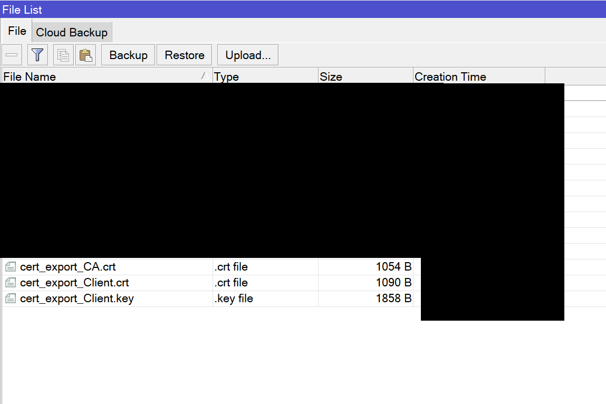

#### Transferring the Files

* Go to **Files** and select the three certificate files. Their names should be similar to:
    * `cert_export_CA.crt` (or `CA.crt`)
    * `cert_export_Client.crt` (or `Client.crt`)
    * `cert_export_Client.key` (or `Client.key`)
* Right-click on each file and download them.

>>>>>  gd2md-html alert: inline image link here (to images/image26.png). Store image on your image server and adjust path/filename/extension if necessary.  (<a href="#">Back to top</a>)(<a href="#gdcalert27">Next alert</a>) >>>>> 

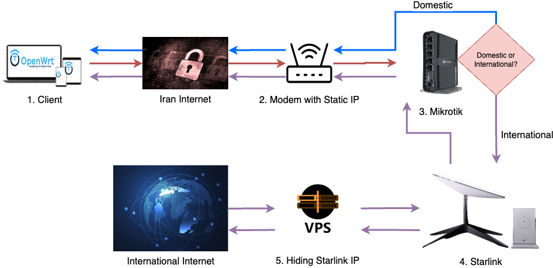

**Recommendation**: It's a good idea to click the **Backup** button and create a backup of the settings you've configured so far.

### Create Client Ovpn File

#### Removing the Passphrase from the Client Key

1. **Download and Install OpenSSL**
    * If you are using Windows, download OpenSSL from a trusted source.
    * Install OpenSSL.
2. **Navigate to the Folder with the OpenVPN Files**
    * Go to the folder where you downloaded the OpenVPN files in the previous step.
    * Copy the folder path. (For example, by right clicking on the address bar and selecting copy address)

>>>>>  gd2md-html alert: inline image link here (to images/image27.png). Store image on your image server and adjust path/filename/extension if necessary.  (<a href="#">Back to top</a>)(<a href="#gdcalert28">Next alert</a>) >>>>> 

3. **Open OpenSSL**
    * Use the `cd` command to navigate to the folder with the OpenVPN files. For example: \
`cd C:\Users\XXXX\Desktop\OpenVPN`
    * Replace `XXXX` with your actual username in Windows.
4. **Run OpenSSL to Remove the Passphrase**
    * In the Command Prompt, enter the following command (replace `cert_export_Client.key` with your actual file name): \
`openssl rsa -in cert_export_Client.key -out client.key`
    * When prompted, enter the passphrase you previously set for the `Client` file.
    * This will create a new `client.key` file without the passphrase.

>>>>>  gd2md-html alert: inline image link here (to images/image28.png). Store image on your image server and adjust path/filename/extension if necessary.  (<a href="#">Back to top</a>)(<a href="#gdcalert29">Next alert</a>) >>>>> 

5. **Upload Your client.key without Passphrase**
    * Go to Files -> Click on Upload and upload your client.key wi
6. **Creating the Client OVPN File**
    * Go to PPP ->  Interface Tab -> Click on OVPN Server ->
    * Select Export ovpn
        1. Server Publ. Address (IP or DNS): Your Static IP
        2. CA Certificate: Select your CA Certificate file
        3. Client Certificate: Select your CA Certificate file
        4. Client Certificate Key: Select your CA Certificate file (the one without passphrase)
        5. Click on Start

>>>>>  gd2md-html alert: inline image link here (to images/image29.png). Store image on your image server and adjust path/filename/extension if necessary.  (<a href="#">Back to top</a>)(<a href="#gdcalert30">Next alert</a>) >>>>> 

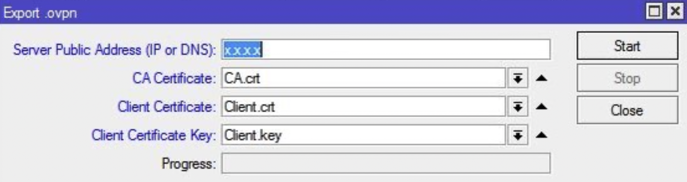

>>>>>  gd2md-html alert: inline image link here (to images/image30.png). Store image on your image server and adjust path/filename/extension if necessary.  (<a href="#">Back to top</a>)(<a href="#gdcalert31">Next alert</a>) >>>>> 

7. **Transfer your OVPN File**
    * Go to **Files** and select your OVPN File. 
        * It should be similar to “Clientxxxx.ovpn”
    * Right-click on each file and download them.

## Split Tunneling

### Routing Configuration

In this section, we will separate internal Iranian traffic from international traffic to ensure:

* Internal services do not detect the use of Starlink.
* There is no need to disconnect the VPN for simultaneous use of internal and international services.

Based on our settings, internal traffic goes to the host modem, and international traffic goes to Starlink.

#### Create a New Routing Table for International Traffic

* Go to **Routing** -> **Tables** -> click **+**.
    * Name: `to-starlink`
    * FIB: ✅
    * Click **OK**.

>>>>>  gd2md-html alert: inline image link here (to images/image31.png). Store image on your image server and adjust path/filename/extension if necessary.  (<a href="#">Back to top</a>)(<a href="#gdcalert32">Next alert</a>) >>>>> 

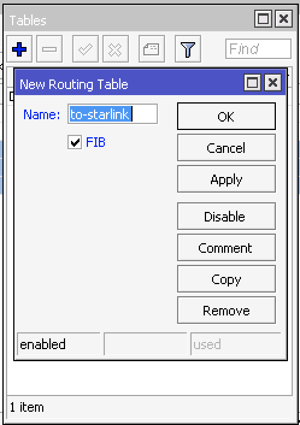

#### Create Iran Addresses List

Create a list of Iranian IP addresses based on the IP range of Iran.

1. **Download the IP List**:
    * Download the list of Iranian IPs and name it `Iran_IP_List.rsc`. The `.rsc` format is preferred.
2. **Upload the IP List**:
    * Go to **Files** -> **Upload**.

>>>>>  gd2md-html alert: inline image link here (to images/image32.png). Store image on your image server and adjust path/filename/extension if necessary.  (<a href="#">Back to top</a>)(<a href="#gdcalert33">Next alert</a>) >>>>> 

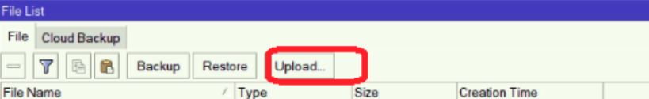

3. **Import the IP List**:
    * Open a new **terminal in your Winbox** and run the following command: \
`import file-name=Iran_IP_List.rsc`

    

>>>>>  gd2md-html alert: inline image link here (to images/image33.png). Store image on your image server and adjust path/filename/extension if necessary.  (<a href="#">Back to top</a>)(<a href="#gdcalert34">Next alert</a>) >>>>> 

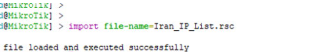

4. **Verify the Address List**:
    * Go to **IP** -> **Firewall** -> **Address Lists Tab**.

>>>>>  gd2md-html alert: inline image link here (to images/image34.png). Store image on your image server and adjust path/filename/extension if necessary.  (<a href="#">Back to top</a>)(<a href="#gdcalert35">Next alert</a>) >>>>> 

#### Enable Remarking and Mangle

We will use the Packet Marking feature of Mikrotik routers to implement Policy-based Routing (PBR), which will split traffic based on our criteria. We want to divide traffic between the VPN Tunnel and the internal internet.

* Go to **IP** -> **Firewall** -> **Mangle Tab** -> click **+**.
* **General Tab**:
    * Chain: `prerouting`
    * Src. Address: VPN Client addresses (This IP pool was created during the NAT setup.)
    * Dst Address List: ❗
    * Dst. Address List: `Iran_IP_List`

>>>>>  gd2md-html alert: inline image link here (to images/image35.png). Store image on your image server and adjust path/filename/extension if necessary.  (<a href="#">Back to top</a>)(<a href="#gdcalert36">Next alert</a>) >>>>> 

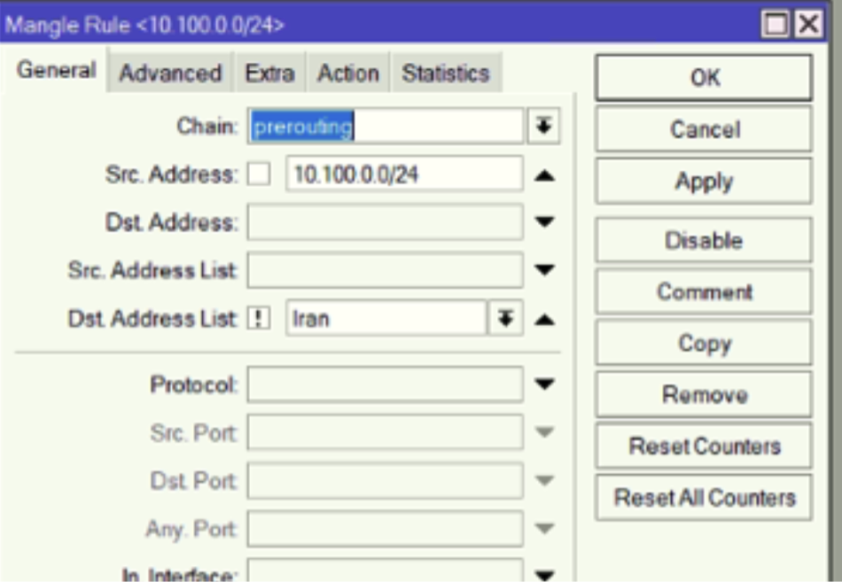

* **Action Tab**:
    * Action: `mark routing`
    * New Routing Mark: `to-starlink`
    * Passthrough: ✅
    * Click **OK**.

>>>>>  gd2md-html alert: inline image link here (to images/image36.png). Store image on your image server and adjust path/filename/extension if necessary.  (<a href="#">Back to top</a>)(<a href="#gdcalert37">Next alert</a>) >>>>> 

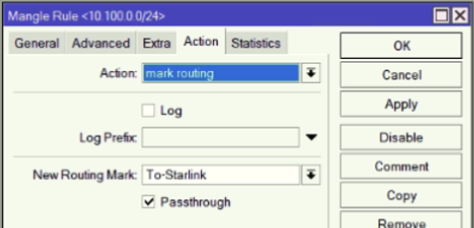

#### Add New Static Routes

Now we need to connect two Static Routes to the WiFi Interface. The first route directs international traffic to Starlink, and the second route directs internal traffic to the host modem.

1. **Static Route to Starlink IP**:
    * Go to **IP** -> **Routes** -> click **+**.
    * **General Tab**:
        * Dst. Address: `0.0.0.0/0` (as a default route)
        * Gateway: `192.168.1.1` (Starlink IP)
        * Distance: `1`
        * Routing Table: `to-starlink`
    * Note: Scope and Target Scope should auto-populate as Scope: 30 and Target Scope: 10.

>>>>>  gd2md-html alert: inline image link here (to images/image37.png). Store image on your image server and adjust path/filename/extension if necessary.  (<a href="#">Back to top</a>)(<a href="#gdcalert38">Next alert</a>) >>>>> 

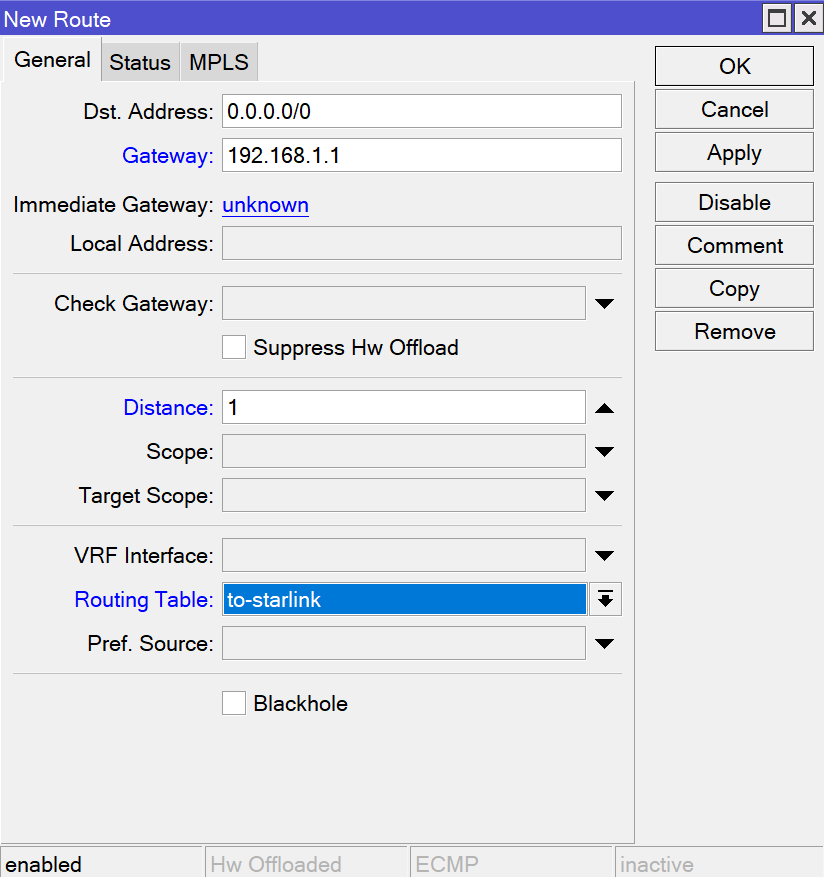

2. **Static Route to host modem IP**:
    * Go to **IP** -> **Routes** -> click **+**.
    * **General Tab**:
        * Dst. Address: `0.0.0.0/0` (as a default route)
        * Gateway: `XX.XX.XX.XX `(your host modem IP - If you don’t know your host modem IP, please read the next step first.)
        * Distance: `10` (This number should be greater than 1 to prioritize between Starlink and the internal internet modem)
        * Routing Table: `main`
    * Note: After confirmation, Scope and Target Scope should auto-populate as Scope: 30 and Target Scope: 10.

>>>>>  gd2md-html alert: inline image link here (to images/image38.png). Store image on your image server and adjust path/filename/extension if necessary.  (<a href="#">Back to top</a>)(<a href="#gdcalert39">Next alert</a>) >>>>> 

###### **Find Your Host Modem IP**

_If you already have your host modem IP, please skip this step._

* _Go to IP -> DHCP Client_
    * _Copy the IP address of <code>ether2</code> and modify the fourth octet to 1. For example, if the IP address is 192.168.5.7, change it to 192.168.5.1 in your mind. This is your host modem IP.</em>

## Hiding Starlink IP

To hide the Starlink IP, we will create an additional hub after Starlink to route traffic through another tunnel. We can use two methods:

1. VPS with Mikrotik Router OS
2. Cloudflare Warp

In this document, we focus on the first option, VPS with Mikrotik Router OS.

### Connect to VPS on Mikrotik Router

* After purchasing a VPS, open a new Winbox window. It is recommended to get your VPS from a secure website outside the country.
* Enter the IP, username, and password, then click Connect. (If your VPS doesn’t have a password, create one.)

### L2TP/IPSEC Setup on VPS with Mikrotik Router

#### 
    **Create IP Pool**:

    * Go to **IP** -> **Pool** -> click **+** (new).
    * Name: `vpn-ipsec`
    * Addresses: `192.168.128.1-192.168.128.254`
    * Next Pool: `none`
    * Click **OK**.

>>>>>  gd2md-html alert: inline image link here (to images/image39.png). Store image on your image server and adjust path/filename/extension if necessary.  (<a href="#">Back to top</a>)(<a href="#gdcalert40">Next alert</a>) >>>>> 

#### Create NAT

* Go to **IP** -> **Firewall** -> **NAT Tab** -> click **+** (new).
* **General Tab**:
    * Chain: `srcnat`
* **Action Tab:**
    * Action: Masquerade
    * Click **OK**.

#### 
    **Create PPP Profile**:	

    * Go to **PPP** -> **Profiles Tab** -> Default Profile.
    * Name: `default`
    * Local Address: Your VPS IP
    * Remote Address: `vpn-ipsec` (the VPN range created earlier)
    * Click **OK**.

>>>>>  gd2md-html alert: inline image link here (to images/image40.png). Store image on your image server and adjust path/filename/extension if necessary.  (<a href="#">Back to top</a>)(<a href="#gdcalert41">Next alert</a>) >>>>> 

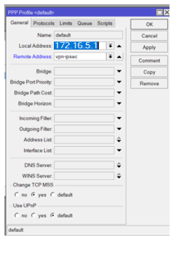

#### 
    **Turn on L2TP Server**:

    * Go to **PPP** -> **Interface** -> **L2TP Server**.
    * Enable: ✅
    * Default Profile: `default-encryption` (or use a default option if not available)
    * Use IPsec: `yes` (or required)
    * IPsec Secret: Enter a password (VPN clients will use this password)
    * Click **OK**.

>>>>>  gd2md-html alert: inline image link here (to images/image41.png). Store image on your image server and adjust path/filename/extension if necessary.  (<a href="#">Back to top</a>)(<a href="#gdcalert42">Next alert</a>) >>>>> 

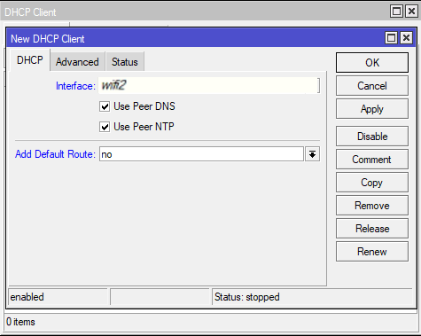

#### 
    **Create VPN User and PPP Secret**:

    * Go to **PPP** -> **Secrets Tab** -> click **+** (new).
    * Name: `dima` (use your preferred user profile names)
    * Password: Enter a password for the user
    * Click **OK**.

>>>>>  gd2md-html alert: inline image link here (to images/image42.png). Store image on your image server and adjust path/filename/extension if necessary.  (<a href="#">Back to top</a>)(<a href="#gdcalert43">Next alert</a>) >>>>> 

### Route OpenVPN Traffic to VPS to Hide Starlink IP

Go back to the Winbox of the Mikrotik router.

#### **Connect to L2TP Server**:

    * Go to **PPP** -> **+** -> **Dial Out Tab**.
    * Connect to: Your VPS IP
    * User: `dima` (VPN user created earlier)
    * Password: VPN user password
    * Use IPsec: ✅
    * IPsec Secret: The IPsec password set earlier
    * Click **OK**.

>>>>>  gd2md-html alert: inline image link here (to images/image43.png). Store image on your image server and adjust path/filename/extension if necessary.  (<a href="#">Back to top</a>)(<a href="#gdcalert44">Next alert</a>) >>>>> 

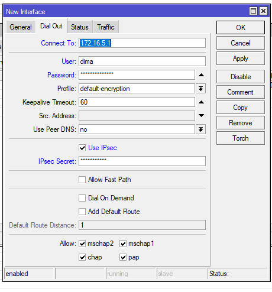

#### Milestone

If L2TP is correctly configured, you should see an `R` (Running) status, either alone or with other letters, in the Status column.

    

>>>>>  gd2md-html alert: inline image link here (to images/image44.png). Store image on your image server and adjust path/filename/extension if necessary.  (<a href="#">Back to top</a>)(<a href="#gdcalert45">Next alert</a>) >>>>> 

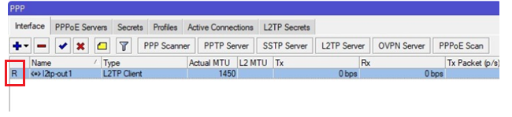

Disable wifi2 NAT

* Go to **IP** -> **Firewall** -> **NAT Tab**
    * Right-Click on wifi2 and disable it.

>>>>>  gd2md-html alert: inline image link here (to images/image45.png). Store image on your image server and adjust path/filename/extension if necessary.  (<a href="#">Back to top</a>)(<a href="#gdcalert46">Next alert</a>) >>>>> 

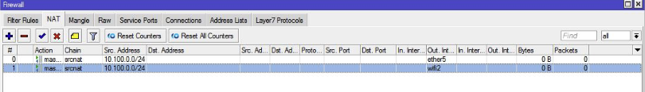

#### Create NAT

* Go to **IP** -> **Firewall** -> **NAT Tab** -> click **+** (new).
* **General Tab**:
    * Chain: `srcnat`
    * Src. Address: `10.100.0.0/24` (the IP pool created earlier)
    * Out. Interface: `l2tp-out 1`

    

>>>>>  gd2md-html alert: inline image link here (to images/image46.png). Store image on your image server and adjust path/filename/extension if necessary.  (<a href="#">Back to top</a>)(<a href="#gdcalert47">Next alert</a>) >>>>> 

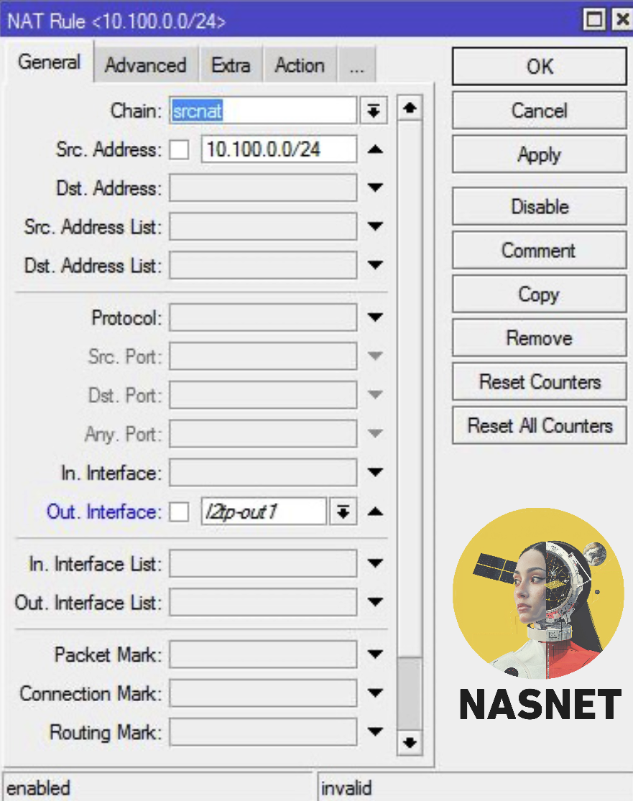

* **Action Tab**:
    * Action: `masquerade`
    * Click **OK**.

>>>>>  gd2md-html alert: inline image link here (to images/image47.png). Store image on your image server and adjust path/filename/extension if necessary.  (<a href="#">Back to top</a>)(<a href="#gdcalert48">Next alert</a>) >>>>> 

#### Add Static Route

* Go to **IP** -> **Route** -> click **+** (new).
* **General Tab**:
    * Dst. Address: `0.0.0.0/0`
    * Gateway: `l2tp-out`
    * Distance: `1` (lower number gives higher priority)
    * Routing-table: `to-starlink`
    * Click **OK**.

    

>>>>>  gd2md-html alert: inline image link here (to images/image48.png). Store image on your image server and adjust path/filename/extension if necessary.  (<a href="#">Back to top</a>)(<a href="#gdcalert49">Next alert</a>) >>>>> 

#### **Route OpenVPN Traffic to VPS**:

* Go to **IP** -> **Route** -> click **+** (new).
* **General Tab**:
    * Dst. Address: `XX.XX.XX.XX/32` (Your VPS IP + /32)
    * Gateway: `192.168.1.1` (Starlink)
    * Distance: `1`
    * Routing Table: `main`
    * Click **OK**.

>>>>>  gd2md-html alert: inline image link here (to images/image49.png). Store image on your image server and adjust path/filename/extension if necessary.  (<a href="#">Back to top</a>)(<a href="#gdcalert50">Next alert</a>) >>>>> 

